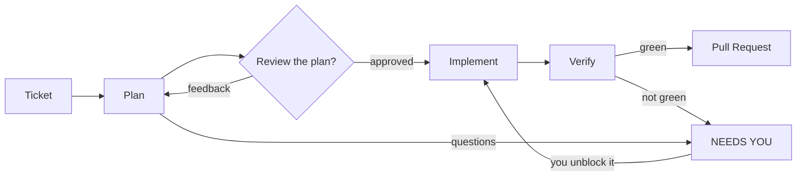
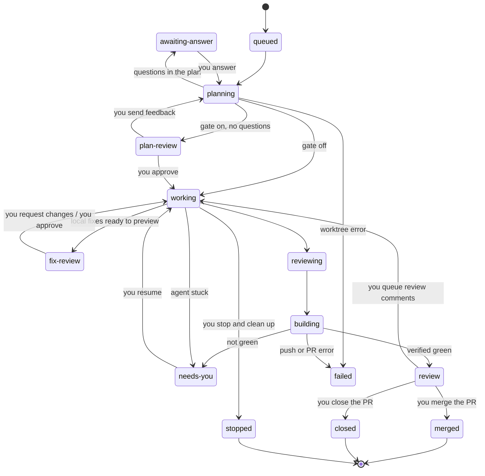
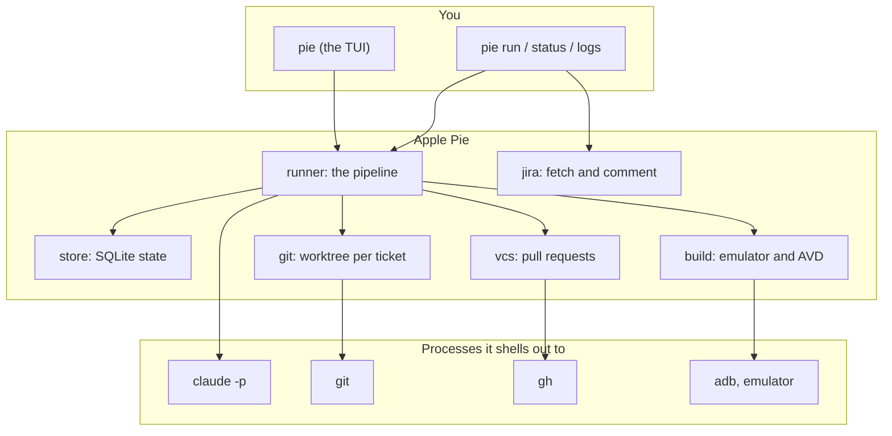

<p align="center">
  
</p>

<p align="center"><strong>Run a team of coding agents on your Android repo, from one terminal.</strong><br><em>Ticket in, reviewed pull request out. You stay the reviewer.</em></p>

<p align="center"><a href="https://github.com/Apple-Pie-AI/pie-tui/releases/latest"></a> <a href="https://github.com/Apple-Pie-AI/pie-tui/releases"></a>  <a href="LICENSE"></a></p>

<p align="center">New here? Start with <a href="#first-steps">First steps</a>.</p>

Apple Pie is an open-source harness for Android (and Kotlin Multiplatform) teams that already use Claude Code. Hand it a ticket. It plans the change, makes it in an isolated git worktree, runs your project's real build and tests, and parks the result for your review before any PR exists. Run several at once. A single dashboard shows you only the tickets that need a decision from you.

It's local, free, and runs on the Claude Code subscription you already have. If your company has approved Claude Code, there's nothing new to approve.

```bash
curl -fsSL https://raw.githubusercontent.com/Apple-Pie-AI/pie-tui/main/install.sh | bash
```

https://github.com/user-attachments/assets/ee551538-f3ea-42ac-88c7-402883b5f250

## The problem

Writing code has largely stopped being the bottleneck. After nine years of Android work, most of my day goes to running the agents instead:

1. **Orchestration.** One terminal, one worktree, and one Android Studio window per agent, and I keep switching between them.
2. **Model selection.** Planning, implementing, and reviewing each call for a different model, and switching between them is manual.
3. **Reviewing output.** One Android Studio window per worktree, one GitHub tab per diff, plus one terminal to ask an AI to review each change.
4. **Feedback loops.** When a reviewer comments, I have to tell the agent to fetch the comments and address them.
5. **PR management.** Once the code is ready, I track PRs, CI, and review threads across every task.

No single step is hard. Together they eat the time the job actually needs: checking that the agent's code won't break anything and fits the architecture and conventions of the codebase.

## What Apple Pie does

Three workflows, all in one keyboard-driven TUI:

- **Ticket → pull request.** Start from a Jira key or a markdown file. The agent plans, implements, adversarially reviews its own diff, and verifies with your real build. [How it works](#how-it-works)
- **Review before the PR.** A split view shows the changed files beside their diff. Send feedback with `@file` references, as you would in Claude Code, and the agent iterates. You can also talk the change through in a plan-mode chat, or approve it and create the PR. [Staying in control](#staying-in-control)
- **Reviewer comments → fixes.** Apple Pie pulls unresolved review threads through `gh`. You pick which ones the agent addresses, preview each fix's diff and its drafted reply, and nothing is pushed or posted until you approve. [When the reviewers come back](#when-the-reviewers-come-back)

Anything that needs you, such as a command outside the allowlist, a blocking question, or a change ready for review, lands in a **NEEDS YOU** section of the dashboard. Everything else keeps running in the background.

What makes that workable day to day:

| | |
|---|---|
| **One worktree per ticket** | Every task and PR gets its own worktree. From the dashboard you can resume it, open it in Android Studio (<kbd>o</kbd>), or reopen its Claude Code session (<kbd>c</kbd>) |
| **Approvals in the dashboard** | Commands outside the allowlist pause the agent and ask you in place: *Allow once*, *Allow & remember*, or *Deny*. Your Claude Code and org-managed rules still apply on top |
| **Per-stage models** | Pick a model for each stage: plan, implement, review, verify, and comment fixes. Set it once in config, no switching mid-task |
| **Emulator when it's needed** | The plan decides whether a ticket needs instrumented tests. Parallel agents share one AVD through a semaphore, and unit-only tickets never boot it |
| **Verified, not vibes** | No certified green build means no PR. The ticket goes to NEEDS YOU instead |
| **Never merges** | Every run stops at `review`. No code path in the project merges a pull request |

The goal isn't agents running unchecked. It's making it practical to run several at once while you stay the one who decides what ships.

## What ships today

| Area | Shipped today | Where it's headed |
|------|---------------|-------------------|
| **Agent CLI** | Claude Code, driven through `claude -p` | Codex and other agentic CLIs behind the same harness |
| **Platform** | Android and KMP on Gradle: AVD/emulator verification, Android Studio handoff | iOS and the rest of the mobile stack |
| **Tickets** | Jira keys and local markdown files | — |
| **Review** | GitHub Pull Requests via `gh` | — |

The left column is real and exercised end to end. The right column is not built yet — there is no Codex adapter, and the Xcode/simulator path for the iOS preview is under active development.

## How it works



| Stage | What it does |
|-------|--------------|
| **Plan** | Explores the codebase read-only and writes a free-form markdown plan. Apple Pie doesn't constrain how it plans — it only extracts what the orchestrator needs: blocking questions, and whether the ticket needs an emulator or unit tests only |
| **Implement** | Makes the change the plan describes, then adversarially reviews its own diff and fixes what that review turns up |
| **Verify** | Discovers how *your* project builds, runs the real build and tests (booting the emulator if needed), and certifies green only after seeing them pass |

The interesting part is verification. Apple Pie does not run Gradle itself. The agent discovers and runs your project's own build and test commands — whatever they are, including company build scripts — and self-certifies the result in a report the orchestrator reads. That report is freshness-checked, so a crashed run can't leave a stale "it passed" behind. No certification, no PR: the ticket goes to **NEEDS YOU** instead.

Apple Pie's own artifacts never reach your PRs. Plans, reports, and review verdicts are archived under `~/.pie`, and the `.agent/` scratch directory agents use inside the worktree is git-excluded and scrubbed before every commit.

## Install

macOS and Linux. Windows is not supported.

```bash
curl -fsSL https://raw.githubusercontent.com/Apple-Pie-AI/pie-tui/main/install.sh | bash
```

Then `pie init` to configure your repo.

| Prerequisite | Why | Check with |
|---|---|---|
| [Claude Code](https://claude.ai/download), authenticated | Every stage runs through `claude -p` | `claude --version` |
| `git` | Worktrees, branches, commits | `git --version` |
| [`gh`](https://cli.github.com), authenticated | Opens and tracks pull requests | `gh auth status` |
| [Android Studio](https://developer.android.com/studio) | Only for tickets that need an emulator | `pie doctor` |
| [Jira](docs/jira.md) | Optional — local `.md` tickets work without it | `pie doctor` |

<details>
<summary>Manual install</summary>

Download the binary for your platform:

```bash
# macOS (Apple Silicon)
curl -fsSL -o pie https://github.com/Apple-Pie-AI/pie-tui/releases/latest/download/pie_darwin_arm64
# macOS (Intel)
curl -fsSL -o pie https://github.com/Apple-Pie-AI/pie-tui/releases/latest/download/pie_darwin_amd64
# Linux (x86-64)
curl -fsSL -o pie https://github.com/Apple-Pie-AI/pie-tui/releases/latest/download/pie_linux_amd64
# Linux (arm64)
curl -fsSL -o pie https://github.com/Apple-Pie-AI/pie-tui/releases/latest/download/pie_linux_arm64
```

Then install it to your user bin (creates the folder, no `sudo`):

```bash
mkdir -p ~/.local/bin && mv pie ~/.local/bin/
```

If `~/.local/bin` isn't on your `PATH` yet:

```bash
echo 'export PATH="$HOME/.local/bin:$PATH"' >> ~/.zshrc && source ~/.zshrc
```

On macOS, if the first run is blocked with `zsh: killed` or a Gatekeeper warning,
clear the download quarantine flag:

```bash
xattr -d com.apple.quarantine ~/.local/bin/pie 2>/dev/null
```

</details>

Versioned archives (`.zip` for macOS, `.tar.gz` for Linux) and a SHA-256 `checksums.txt` are attached to every release.

Prefer to build it yourself? See [Under the hood](#under-the-hood).

## First steps

Never run this before? Do these eight steps in order. Nothing here touches your repo or opens a PR until step 8.

**1. Check your prerequisites.**

```bash
claude --version && gh auth status && git --version
```

Claude Code has to have been launched and signed in at least once. `gh` should say *Logged in*. Android Studio only matters for tickets that need an emulator, so skip it for now.

**2. Install, then confirm the binary is on your PATH.**

```bash
curl -fsSL https://raw.githubusercontent.com/Apple-Pie-AI/pie-tui/main/install.sh | bash
pie --help
```

**Check:** `pie --help` prints the command list. If you get `command not found`, `~/.local/bin` isn't on your PATH — the installer prints the exact line to add for your shell.

**3. Configure it against your Android repo.**

```bash
cd ~/path/to/your/android-repo
pie init
```

The wizard asks, in order: **repo path** (pre-filled with your current directory — accept it), **branch pattern** (accept `{ticket}-{slug}`), **plan review gate** (say **yes** for your first few runs — it's the single best beginner default), **three optional models** (leave all blank to use Claude Code's defaults), **Anthropic API key** (optional — leave blank to use your logged-in `claude` session; if you do enter one it goes to the OS keychain, never the config file), and **telemetry consent**.

**Check:** `ls -l ~/.pie/config.toml` shows a `0600` file.

**4. Run the connectivity check.**

```bash
pie doctor
```

**Check:** the three required checks — git origin, `claude`, `gh` — pass. The optional ones (`adb`, `emulator`, AVD name) can fail for now; they only matter once a ticket needs instrumented tests.

**5. Write your first ticket as a markdown file.**

```bash
cat > ~/first-ticket.md <<'EOF'
# Add a TODO comment to the main Activity

Add a single `// TODO: hello from Apple Pie` comment at the top of the
app's main Activity class. Nothing else.
EOF
```

The ticket id comes from the **filename**: uppercased, with every run of non-alphanumeric characters collapsed to a dash. So `first-ticket.md` becomes `FIRST-TICKET`, and that id names the worktree, the log file, and the branch.

**6. Run it — safely.**

```bash
pie run ~/first-ticket.md --dry-run --review-plan
```

Five things make this safe to try: no Jira account is involved; `--dry-run` skips push and PR entirely, so nothing reaches GitHub; `--review-plan` stops the run *before a single line of code is written*; all work happens in `~/.pie/worktrees/FIRST-TICKET`, not in your checkout; and the change itself is one comment line.

**Check:** run `git status` in your own repo. It's untouched.

**7. Watch it from the dashboard.**

```bash
pie
```

Bare `pie` opens the TUI. Tickets are grouped under **NEEDS YOU**, **RUNNING**, **READY FOR REVIEW**, and **STOPPED**; the footer lists the keys. Press <kbd>enter</kbd> on your ticket to read the full plan, approve it, and watch it work through to READY FOR REVIEW.

**Check:**

```bash
cat ~/.pie/plans/FIRST-TICKET.md              # the plan it wrote
git -C ~/.pie/worktrees/FIRST-TICKET diff     # the change it made
pie logs FIRST-TICKET                         # the whole session
```

**8. Do it for real.** Drop `--dry-run` on a second local ticket to get an actual pull request, or connect [Jira](docs/jira.md) and run `pie run PROJ-123`.

Whichever you pick, the guarantee is the same: **it stops at `review`. Apple Pie never merges anything.** When you're done experimenting, press <kbd>x</kbd> on a ticket in the TUI to stop it and remove its worktree.

## Using it day to day

Bare `pie` is the dashboard, and it's where most of the work happens: write or paste a ticket, confirm its id and branch name, press enter. Queue several and they run in parallel.

| Key | Action |
|---|---|
| <kbd>↑</kbd> <kbd>↓</kbd> | Move |
| <kbd>enter</kbd> | Choose — on a paused ticket, read its plan |
| <kbd>n</kbd> | Start new ticket(s) |
| <kbd>a</kbd> | Answer a blocked ticket |
| <kbd>o</kbd> | Open the worktree in Android Studio |
| <kbd>c</kbd> | Open the session in Claude Code |
| <kbd>R</kbd> | Resume from the last stage |
| <kbd>x</kbd> | Stop and clean up |
| <kbd>:</kbd> | Command palette — everything above, plus doctor, config, and the daemon |

Everything is available from the CLI too:

```bash
pie run PROJ-123              # one ticket → PR
pie run PROJ-123 PROJ-124     # two tickets in parallel
pie run a.md b.md c.md        # local markdown tickets, in parallel

pie doctor                    # check git, claude, and gh connectivity
pie logs PROJ-123             # print the session log for a ticket
pie status                    # table of all sessions (--watch to follow)
pie start                     # background cleanup daemon (--once for a single pass)
pie stop                      # stop the daemon
pie --splash                  # replay the title screen
```

`pie start` is a janitor, not a scheduler — it reclaims worktrees once their PRs are merged or closed, and shuts the emulator down when it's been idle. Tickets are always started by you, from `pie run` or the TUI.

### Every `pie run` flag

| Flag | What it does |
|---|---|
| `--dry-run` | Everything except `git push` and the PR. Try this first |
| `--review-plan` | Pause after planning so you can approve or redirect before any code is written |
| `--branch <name>` | Exact branch name for the PR, overriding the config pattern. One ticket at a time |
| `--from-branch <name>` | Work ON an existing branch instead of creating one — address PR feedback, or have the agent review a PR's code. Never resets the branch. One ticket at a time |
| `--base <ref>` | Base branch — or another ticket's id — to stack on. The PR targets it |
| `--repo <path>` | Which configured repo to use. Defaults to the first one |
| `--resume` | Keep your manual fixes in the existing worktree, re-run verification, then PR |
| `--ship` | Skip verification entirely: commit, push, and PR from your manual fix |
| `--from-plan` | Skip planning and implement from the `plan.json` already in the worktree |
| `--address-comments` | Fix the PR review comments selected in the dashboard — locally only, then pause at `fixes ready` for your approval. The TUI spawns this for you |
| `--feedback <text>` | With `--address-comments`: revise the local fixes per this correction, resuming the fix session. The TUI's "Request changes" sends this |
| `--ship-comments` | The approval: verify, commit, push to the PR, and post the previewed replies. The TUI's approve bar spawns this |
| `--local` | Skip Jira and take the ticket from `--title`/`--desc` |
| `--title` / `--desc` | The ticket summary and body, with `--local` |
| `--splash` | Replay the title screen first. Works on any command |

`--base` accepts a ticket id as well as a branch name, so `pie run PROJ-124 --base PROJ-123` builds on the branch PROJ-123 created and opens its PR against it. A plain re-run of a stacked ticket keeps its base rather than silently resetting to the default branch.

## Staying in control

Apple Pie is built to hand tickets back rather than plough through them. Three mechanisms do that.

**The plan review gate.** Turn it on per ticket when queueing, with `--review-plan`, or as your default with `review_plans` in the config. The run pauses after planning; you read the plan in the TUI's full-screen viewer and either approve it or send feedback for a re-plan. Every plan is archived to `~/.pie/plans/<ticket>.md` regardless, so you can read it after the fact with **View Plan**.

**The review-before-PR gate (on by default).** After the agent's change builds and verifies, the ticket parks under NEEDS YOU as "review before PR" — nothing is committed, pushed, or opened as a PR yet. Enter opens the change screen: the file list with the verify summary on the left, each file's diff on the right; → reads a file full screen, enter inside it scrolls, and enter while scrolling anchors a note to the visible lines. Mark files with notes or revert them to base (both pending and undoable until an action runs), then **Send feedback** — the agent reworks and the screen returns as round 2, showing what changed since your feedback — or **Create pull request**, which re-verifies only if the change moved (your hand-edits in Android Studio count) and then ships. Turn the gate off with `review_before_pr = false`.

**NEEDS YOU.** An ambiguous ticket, a compile error the agent can't fix, or a verification that never went green all land here rather than being forced through. Answer in the TUI, resume the Claude session, or open the worktree in Android Studio and fix it by hand — then `--resume` to re-verify, or `--ship` to trust your fix and PR straight away.

**It stops at `review`.** There is no auto-merge, no merge flag, and no code path anywhere in the project that merges a pull request.

**In-dashboard command approvals.** Agent Bash commands are gated by an allowlist, and your own Claude Code settings (including org-managed `ask`/`deny` rules) always apply on top. When a command needs a human — an `ask` rule fired, or the command isn't allowlisted — the agent pauses and the question comes to the dashboard: a `⏸` banner, the exact rule each *Allow & remember* option would write, and *Deny*; the agent continues in the same session the moment you answer. Commands your allowlist already covers are approved automatically, and everything you've remembered is reviewable, addable, and removable from **Edit config → Edit command allowlist** — arrows, Enter, and Esc, nothing else to learn. The full model — layers, denial diagnosis, the `⏸ approve:` log lines to look for — is in [docs/permissions.md](docs/permissions.md).



These are the state names `pie status` and the dashboard print. Two rules worth knowing: blocking questions always win over the plan review gate — if the plan has questions you'll be asked them even with the gate off. And `merged` and `closed` aren't set by a run; the cleanup daemon writes them later when it sees what you did with the PR.

## When the reviewers come back

A PR at `review` isn't done — humans (and bots) leave comments on it. The dashboard polls your open PRs and shows a **`N comments`** badge on any ticket whose PR has unresolved review threads. Press <kbd>enter</kbd> on it to triage them.

**One list, one cursor, three keys.** Every open thread is a row: a checkbox, where it's anchored, what it says, and who said it. If the reviewer opened with a marker of their own — `nit:`, `blocking:` — it's lifted out of the prose and shown beside their name in the detail pane; nothing is inferred, because guessing severity from wording would misstate what a reviewer meant. <kbd>↑</kbd><kbd>↓</kbd> moves, <kbd>enter</kbd> acts on the row you're on, <kbd>esc</kbd> backs out one level. There are no letter shortcuts.

<kbd>enter</kbd> on a comment opens its menu: skip it (or fix it), write an instruction for the agent, or open the thread on GitHub. The first item is pre-selected and states the outcome, so skipping a comment is <kbd>enter</kbd> <kbd>enter</kbd>.

The first row is `all comments (8)` — the same box, no menu, and one press flips the lot. That plus the menu is the intended workflow: clear everything in one keystroke, then walk down and check the few you want. The last row is the run row, which spells out what it's about to do before you press it. Below the list, the detail pane shows the file and line, the diff hunk, the comment in full, and **your instruction** — guidance the agent reads before fixing that one comment ("use the existing retry helper"). It is not a reply to the reviewer, which is why it isn't called a note. Rows carrying one show `✎`.

**Nothing is hidden.** Every comment is listed, bots included — CodeRabbit, Copilot and Sonar just get their names tinted. A filter that hides them by default hides their blocking findings and CVE reports too, which is exactly the kind of comment you can't afford to answer a PR without reading. Fetching is automatic (on entry, then every two minutes); the header says `synced 2m ago`, or `sync failed — retrying`.

Run the batch and Apple Pie re-enters the ticket's existing worktree and applies exactly the comments you selected — **locally, and then it stops**. Nothing is committed, pushed, or posted yet. The ticket parks at `fixes ready` and the screen becomes a preview: per comment, the actual worktree diff the fix produced and the reply the agent drafted for the reviewer (or its reason for declining). Three verbs from there:

- **Edit the reply** — rewrite the draft inline; it posts exactly as you typed it, nothing more.
- **Request changes** — tell the agent what's wrong ("use the existing retry helper instead"); it revises the local fixes in the same session and the preview refreshes. Loop as many times as you like — feedback rounds are fast because verification waits until the end.
- **Exclude from this ship** — leave a thread open for a later pass; Apple Pie will not mark it addressed, reply to it, or resolve it. If its local code also needs undoing, request changes and tell the agent to revert that part of the batch.
- **Approve** — the run bar says what it's about to do: verify the build, commit, push to the same branch (the open PR updates in place), post each reply, and mark the threads resolved. Only then does anything leave your machine. The reply and resolve write-backs stay switchable (`review_reply`, `review_resolve`) — on some teams, resolving a thread is the reviewer's call.

The preview is durable — it lives in the worktree and the state database, so you can close the TUI, sleep on it, and approve tomorrow. And a skipped or half-fixed batch isn't a dead end: threads you didn't include keep their badge, and a reviewer replying to any thread reopens it on the next poll.

## Why Android-native matters

General ticket→PR agents don't know what verifying an Android change means. Apple Pie does:

- **Emulator as a shared resource.** The SDK and AVD are auto-detected, and a SQLite-backed semaphore lets parallel agents take turns on one AVD — no two agents fight over a device.
- **Instrumented vs. unit test routing.** Decided at plan time, enforced at verify time.
- **Worktree → Android Studio handoff.** One keystroke opens any agent's worktree in the IDE.
- **Screenshot tickets.** Drag images into the terminal; the agent sees them while planning.

## Configuration

Everything Apple Pie owns lives in one directory:

```
~/.pie/
├── config.toml              your settings (mode 0600)
├── state.db                 SQLite: session and emulator state
├── worktrees/<TICKET>/      one git worktree per ticket
├── plans/<TICKET>.md        archived plans (and .json)
├── reports/<TICKET>.json    what the agent did, and its verification verdict
├── logs/<TICKET>.log        full session log — what `pie logs` prints
├── templates/               PR body and Jira comment templates you can edit
├── daemon.pid, daemon.log   the cleanup daemon
└── splash-seen              so the title screen only plays once
```

The keys you'll actually touch in `config.toml`:

| Key | Default | |
|---|---|---|
| `[[repo]] path` | — | Your Android project |
| `[[repo]] branch` | `{ticket}-{slug}` | Branch pattern. `{ticket}` is the lowercased id, `{slug}` the kebab-cased title |
| `[[repo]] base` | the repo's default branch | What PRs target |
| `review_plans` | `false` | Pause every ticket for plan review |
| `review_before_pr` | `true` | Pause every ticket after a green verify to review the change before its PR is created |
| `review_reply` | `true` | Reply "Fixed in `<sha>`" on each review thread a comment-fix run addresses |
| `review_resolve` | `true` | Also mark those threads resolved. Turn off where that's the reviewer's call |
| `model_plan` / `model_impl` / `model_review` | blank | Per-stage models. Blank uses Claude Code's default |
| `model_verify` / `model_comment_fix` | blank | Models for the verify stage and PR review-comment fixes. Blank falls back to `model_impl` |
| `max_budget_usd` | `5` | Per-ticket ceiling passed to `claude` |

Secrets never go in the config file — they live in your OS keychain, or in `PIE_JIRA_TOKEN` / `PIE_ANTHROPIC_TOKEN` / `PIE_GIT_TOKEN` for headless use. `PIE_HOME` relocates the whole directory; `PIE_NO_SPLASH=1` and `PIE_NO_SOUND=1` quiet the title screen.

### Reading the allowlist

The rules you'll see in **Edit config → Edit command allowlist** (and in `allowed_tools` / `extra_allowed_tools`) are written in **Claude Code's own permission syntax** — Apple Pie passes them through verbatim, and the same strings work in `~/.claude/settings.json`'s `permissions` arrays. Two kinds of token:

```
Read                  ← a bare name grants one of Claude Code's built-in tools
Bash(git diff:*)      ← a Bash(...) rule gates one shell command, by prefix
```

- **Bare names** are Claude Code's structured tools, not shell commands: `Read` reads a file by path, `Glob` finds files by pattern, `Grep` searches contents, `Edit`/`MultiEdit` make targeted edits, `Write` creates a file, `TodoWrite` is the agent's internal checklist. `Read` does **not** cover `ls` or `cat` — those are shell commands.
- **`Bash(...)` rules** gate the shell, per command: `Bash(ls:*)` allows anything starting with `ls`, and a rule without `:*` (like `Bash(cd App && ./gradlew test)`, the shape *Allow & remember exact* writes) matches only that verbatim string. Compound commands are checked **per segment** — `cd App && ./gradlew test` needs both `Bash(cd:*)` and `Bash(./gradlew:*)`.

The default list carries both `Read`/`Glob`/`Grep` *and* `Bash(cat:*)`/`Bash(ls:*)`/`Bash(grep:*)` because an agent may read a file through either route, and each is permissioned independently. The full model — layers, rule syntax, approvals — is in **[docs/permissions.md](docs/permissions.md)**.

Full reference: **[docs/configuration.md](docs/configuration.md)**.

## Cost, telemetry, and privacy

Apple Pie runs on your existing Claude Code subscription or API key. There's no separate account and no markup. Each ticket costs a full working session's worth of tokens, so five parallel tickets is roughly five concurrent sessions. Start with one.

Telemetry is opt-in, asked once during `pie init`. When enabled it sends three events — `run_started`, `run_completed`, `tui_opened` — carrying a randomly generated device id, your OS and architecture, the Apple Pie version, and for a completed run its outcome state, duration in seconds, and whether it errored. **No ticket content, no file paths, no repo or branch names, no code.** Turn it off any time with `telemetry_enabled = false` in `~/.pie/config.toml`.

## Troubleshooting

| Symptom | Fix |
|---|---|
| `pie: command not found` | `~/.local/bin` isn't on your PATH. The installer prints the line to add |
| A run fails immediately | `pie doctor` — it's almost always `gh` or `claude` auth |
| A ticket is stuck or vanished | `pie logs <TICKET>` has the full session. `pie status` shows every state |
| A ticket landed in NEEDS YOU | Read the reason in the TUI, fix it in `~/.pie/worktrees/<TICKET>`, then `pie run <TICKET> --resume` |
| Verification skips instrumented tests | `pie doctor` — `avd_name` is probably unset, so it fell back to unit tests |
| A worktree is wedged | Press <kbd>x</kbd> in the TUI to stop and clean up, then re-run |
| `go.mod requires go >= 1.26.2` | Building from source with an older Go: prefix with `GOTOOLCHAIN=auto` |

## Under the hood



Apple Pie shells out to the real tools rather than wrapping their SDKs. Your `git`, your `gh`, your `claude`, your Android SDK — same binaries, same auth, same config you already use. That keeps the packages small and means anything you can do by hand, Apple Pie can do the same way. It's a single Go binary with no cgo, so releases cross-compile cleanly for macOS and Linux.

```bash
git clone https://github.com/Apple-Pie-AI/pie-tui && cd pie-tui
make build      # → ./pie
make install    # → ~/.local/bin/pie
make test       # go test ./...
```

Go 1.26.2 or newer. On an older toolchain, prefix with `GOTOOLCHAIN=auto` and Go will fetch the right one.

### Building release binaries

`make build` gives you a quick host binary. To produce distributable builds, use `scripts/build.sh`, which has two shapes:

```bash
scripts/build.sh test   # plain go build     → dist/test/<os>_<arch>/pie
scripts/build.sh prod   # obfuscated build   → dist/prod/<os>_<arch>/pie
```

`prod` is what ships: it runs the binary through [garble](https://github.com/burrowers/garble) at max settings (`-literals -tiny -seed=random`), so string constants are encrypted, the symbol table is stripped, and there are no readable stack traces (Decision 18). `test` is the same code without obfuscation — faster to build and debuggable.

The default target is **darwin/arm64** (Apple Silicon). Add more with flags:

| Flag | Effect |
|---|---|
| `--linux` | also build `linux/amd64` + `linux/arm64` |
| `--darwin-amd64` | also build `darwin/amd64` (Intel Mac) |
| `--windows` | coming soon — not yet buildable (unix-only syscalls), skipped with a note |
| `--all` | every buildable target |
| `--clean` | wipe `dist/<mode>/` first |
| `--version V` | override the version string (default: `git describe`) |

```bash
scripts/build.sh prod --linux --clean     # obfuscated macOS-arm64 + both Linux arches
make build-prod ARGS='--linux --clean'     # same, via the Makefile
make build-test ARGS='--all'               # non-obfuscated, every target
```

macOS binaries are ad-hoc codesigned so Gatekeeper doesn't kill them. A `prod` build needs a real Go SDK matching `go.mod` on `PATH` (garble can't use the `GOTOOLCHAIN` auto-download path); the script finds a `golang.org/dl` SDK for you, or install one with `go install golang.org/dl/go1.26.2@latest && go1.26.2 download`.

For a **published, tagged release** — cross-platform archives (`.tar.gz` for Linux, `.zip` for macOS), checksums, and the GitHub release — GoReleaser remains the tool (`make snapshot-obf` to dry-run it locally). See [RELEASE.md](RELEASE.md). `scripts/build.sh` is for producing binaries; GoReleaser is for packaging and publishing them.

Deeper detail — the package map, the agent's JSON contract, the worktree strategy, and the emulator semaphore — is in **[docs/architecture.md](docs/architecture.md)**. Release process is in [RELEASE.md](RELEASE.md).

## FAQ

**Does it need Claude Code?**
Yes. Every stage runs through `claude -p` on your existing subscription or API key. There's no Apple Pie account and no separate key. Adapters for other agentic CLIs, such as Codex, are planned but not built.

**Is anything sent to a server?**
No. There's no Apple Pie server. Plans, logs, state, and worktrees all live under `~/.pie` on your machine. The only thing that ever leaves is opt-in telemetry: three anonymous events, with no code, paths, or ticket content ([details](#cost-telemetry-and-privacy)).

**Is it open source?**
Yes, MIT-licensed. Everything in the binary is in this repo.

**Why not just prompt Claude Code directly?**
You can, and Apple Pie still does, under the hood. What it adds is everything around the prompt: a worktree per ticket, a verify stage that won't let an unverified change become a PR, a review gate before anything is pushed, a PR-comment triage loop, a shared emulator, and one dashboard for all of it. Those are the parts you'd otherwise run by hand across terminals.

**Why Android-specific?**
A general ticket-to-PR agent doesn't know what verifying an Android change means: which changes need instrumented tests on an emulator, how to share one AVD between parallel agents, or how to hand a worktree to Android Studio. See [Why Android-native matters](#why-android-native-matters).

**Does it work with build systems other than Gradle?**
Not today. The agent runs your project's own build commands, including company wrapper scripts and KMP modules, but the prompts and default allowlist assume a Gradle project.

**Why "Apple Pie"?**
I like apple pie, the dessert. It has nothing to do with Apple or iOS. This is an Android tool through and through.

## Why I built it

My company measures productivity by PRs merged. I ran Claude Code agents in parallel with git worktrees to keep up, and ended up supervising every one of them: terminals, branches, plan mode, the emulator, PR descriptions, review comments. Apple Pie automates that toil. My own PR count roughly doubled, and now I mostly just review.

## Uninstall

```bash
pie stop 2>/dev/null                              # stop the daemon if it's running
rm ~/.local/bin/pie                               # remove the binary
rm -rf ~/.pie                                     # config, state, logs, worktrees
security delete-generic-password -s pie 2>/dev/null   # macOS: any stored keys
```

Everything Apple Pie writes lives under `~/.pie`, so that's the whole of it.

## License

MIT — see [LICENSE](LICENSE).
