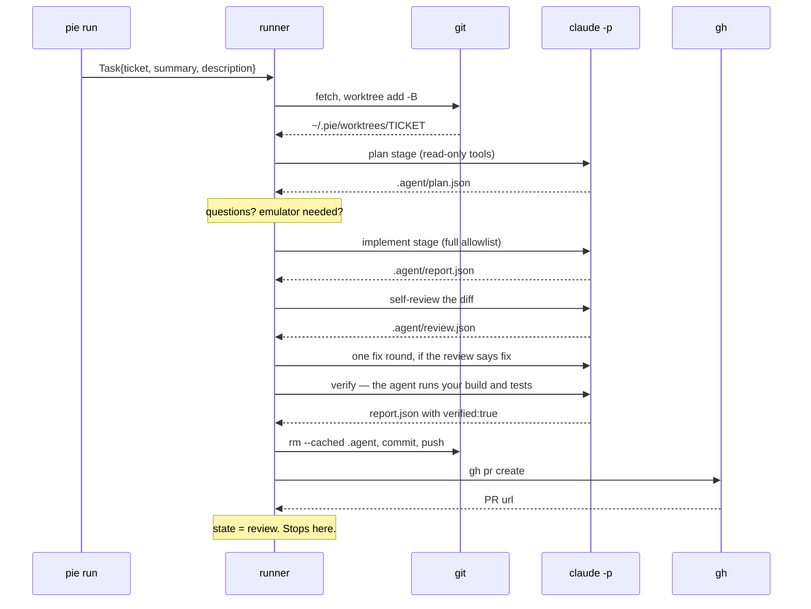

# Architecture

How Apple Pie is put together, for anyone reading or extending the code.

The whole thing is a single Go binary with no cgo. Packages are small, dependency-light, and shell out to the real tools — `git`, `gh`, `claude`, `adb`, `emulator` — rather than wrapping their SDKs. That's the central design bet: your auth, your config, your versions, and anything you can do by hand, Apple Pie does the same way.

## Packages

```
main.go             the entrypoint, at the repo root
cmd/                Cobra wiring only — one file per command, ~1,100 LOC
internal/
  tui               the Bubble Tea hub — one file per screen
  runner            the per-ticket pipeline — the hub
                    runner.go (the staged Run) · task.go (Task/Hooks/Outcome)
                    ship.go · verify.go · emulator.go · archive.go · naming.go
  agent             drives `claude -p`
                    agent.go (subprocess + stream-json) · contract.go (the .agent/ JSON
                    contract and its readers) · prompts.go (the prompt corpus)
  store             SQLite: session state + the emulator semaphore
                    store.go (schema) · sessions.go · emulator.go · states.go
  daemon            the poll loop behind `pie start`/`stop`
  ticket            local .md ticket parsing, id derivation, pasted tickets
  git               worktree-per-ticket, branches, commit, push
  vcs               `gh` pull requests, PR body + comment templating
  emulator          Android SDK/AVD manager — boot/wait/kill, and no build at all
  jira              Jira Cloud REST: fetch issue, add comment
  config            ~/.pie/config.toml
  secrets           OS keychain + env fallback
  proc              process liveness + termination, and the daemon pidfile
  paths             the ~/.pie layout — the leaf everything funnels through
  telemetry         fire-and-forget PostHog events
  splash / sound    first-run title screen and its synthesized chiptune
```

Import direction:

```
cmd     → everything
tui     → agent, config, git, jira, paths, proc, runner, secrets, store, telemetry, ticket
runner  → agent, config, emulator, git, paths, proc, store, vcs
daemon  → config, emulator, git, paths, proc, store, vcs
splash  → paths, sound
config, git, proc, ticket, vcs → paths
agent, emulator, jira, secrets, sound, store, telemetry → nothing internal
```

Three things worth noticing.

**`runner` does not import `jira`.** Jira I/O is inverted: `runner.Hooks.Comment` is a callback, supplied by `cmd` with a Jira-posting implementation for Jira tickets and a log-writing one for local `.md` tickets. The pipeline never learns which it got. That's what lets local markdown tickets work with zero Jira configuration and no branching inside the pipeline.

**`runner` never touches `telemetry` or `secrets`.** `cmd` owns consent and event emission, and reads the keychain itself and passes the result in on `runner.Task.AnthropicKey`. The pipeline therefore has no opinion about telemetry and no dependency on the one package that shells out to macOS `security` — which is what lets it run in a container.

**`cmd` is Cobra wiring and nothing else.** The TUI is `internal/tui`, reached through the single `tui.Run(version)` entrypoint; ticket parsing is `internal/ticket`, shared by `pie run` and the hub. `var version` stays in `cmd/root.go` because both the Makefile and `.goreleaser.yaml` name it as their `-ldflags -X` target.

`internal/sound` synthesizes PCM in pure Go and plays it through whatever audio command the OS already has (`afplay`, `paplay`, `aplay`, `play`, `ffplay`) — deliberately no audio library, because releases are `CGO_ENABLED=0` cross-compiled and every Go audio library needs cgo. If no player exists, the splash is silent.

## One `pie run`, end to end

`runner.Run` sequences six stages: **PLAN → CLARIFY → IMPLEMENT → SELF-REVIEW → GATE → PR**.



Each `claude` invocation after the first resumes the previous session, so the implement, review, and verify stages share one context.

The emulator boot is kicked off in the background as soon as the plan is read, so it overlaps implementation instead of blocking on it. Just before verify, the runner waits on that boot and then acquires the shared AVD.

Three alternate entry paths short-circuit the sequence:

| Flag | Path |
|---|---|
| `--from-plan` | Skips plan and clarify; implements from the `plan.json` already in the worktree |
| `--resume` | Existing worktree, verify only — the agent may confirm but **not edit**. Green → ship, red → NEEDS YOU |
| `--ship` | No verification at all. Commit, push, PR. Trusts your manual fix |

## The agent contract

`internal/agent` invokes:

```
claude -p <prompt>
  --output-format stream-json --verbose
  --permission-mode acceptEdits
  --allowed-tools <per-stage allowlist>
  [--settings <sandbox json>] [--model …] [--max-budget-usd …] [--resume <session>]
```

with `cmd.Dir` set to the worktree. Stdout is parsed line by line as stream JSON: `system/init` records the session id, `assistant` events surface text and `⚙ Tool(detail)` lines into the ticket log, `result` closes it out. The session id is persisted so later stages can `--resume` into it, and so the TUI's **Open in Claude Code** can drop you into the same conversation.

Two load-bearing details.

Stdout is drained in a goroutine while `cmd.Wait()` is awaited separately. Gradle daemons forked during verify inherit `claude`'s stdout descriptor and the pipe never reaches EOF — reading to EOF before waiting used to hang tickets in `building` forever.

And the process is cancellable. `claude` runs under `exec.CommandContext` in its **own process group**, and cancelling sends SIGTERM to the group rather than the single pid — because the thing being cancelled spawns real work of its own (test runners, build tools) that would otherwise keep writing to a worktree already being deleted. See [Cancellation](#cancellation).

The agent communicates back through three files in the worktree's `.agent/` directory.

```go
// .agent/plan.json — written by the plan stage
type Plan struct {
	Plan          string   `json:"plan"`           // free-form markdown
	Questions     []string `json:"questions"`      // blocking ambiguities; empty = proceed
	Confidence    string   `json:"confidence"`     // "high" | "medium" | "low"
	Type          string   `json:"type"`           // "bug" | "feature" | "chore"
	NeedsEmulator bool     `json:"needs_emulator"` // instrumentation tests required
}

// .agent/review.json — written by the self-review stage
type Review struct {
	Verdict string   `json:"verdict"` // "pass" | "fix"
	Issues  []string `json:"issues"`
}

// .agent/report.json — written by implement, updated by verify
type Report struct {
	Status       string   `json:"status"` // "ready_for_build" | "needs_human"
	Summary      string   `json:"summary"`
	FilesChanged []string `json:"filesChanged"`
	Branch       string   `json:"branch"`
	Tests        string   `json:"tests"`
	PRBody       string   `json:"prBody,omitempty"`
	Verified     *bool    `json:"verified,omitempty"`
	VerifyLog    string   `json:"verifyLog,omitempty"`
}
```

The plan is deliberately unstructured. Apple Pie doesn't dictate how Claude plans — it extracts only the two things the orchestrator has to act on: blocking questions, and whether an emulator is needed.

### `verified` is the gate

`report.Verified` is the agent's self-certification that it ran this project's own build and tests and watched them pass. The orchestrator trusts it and runs no build commands of its own. That's what makes per-project setups and company build skills work without configuration.

Trusting a file the agent wrote needs one guard, because `.agent/` is git-excluded and never purged between runs: a crashed verify session would otherwise leave the *previous* run's `verified: true` sitting on disk. So the report is read through `ReadReportSince(worktree, stageStart)`, which rejects anything not modified during this stage. Stale report → `ErrStaleReport` → the ticket goes to NEEDS YOU. It fails closed.

`--ship` is the only way past this, and it's explicitly a human saying "I checked it myself."

`report.PRBody` is trusted for the pull request description, but repaired: `vcs.MissingSections` diffs the repo's own PR template headings against what the model produced, and `vcs.RepairSections` appends anything it dropped verbatim.

### Tool allowlists

Each stage gets the narrowest allowlist that lets it work:

- **Plan** — `Write Read Glob Grep Task TodoWrite` plus read-only `Bash`: `ls`, `cat`, `head`, `tail`, `grep`, `rg`, `find`, `git status|diff|log|show`. It can write its plan and nothing else.
- **Self-review** — `Write Read Glob Grep` plus `git diff|show|log`, `ls`. It reads the diff and writes a verdict.
- **Implement and verify** — the configurable `allowed_tools` from your config.

## Worktrees

One worktree per ticket, at `~/.pie/worktrees/<TICKET>` — in Apple Pie's home, never inside your repo, regardless of which repo the ticket came from. Your checkout is never modified.

Creation takes a per-repo mutex (concurrent `.git/config` writes corrupt it), then `git fetch origin --prune` → remove and prune any stale worktree → `git worktree add -B <branch> <dir> <baseRef>`. `-B` resets the branch to the base, so a re-run always starts clean. If git reports the path is already in use, the stale path is parsed out of the error and removed — but only after `paths.UnderWorktrees` confirms it's inside Apple Pie's own directory. Recursive deletes never run on a path Apple Pie didn't construct.

Base ref resolution, in order: `--base` → the base recorded when the ticket was created (so re-running a stacked ticket doesn't silently reset it) → a local branch of that name → `origin/<name>` → `origin/<default>`. Unresolvable bases go to NEEDS YOU before any git command runs.

Apple Pie's own artifacts are kept out of your commits two ways: `.agent/` is appended to the worktree's `info/exclude`, and `git rm -r --cached --ignore-unmatch .agent` runs immediately before every commit. Plans, reports, and reviews are archived to `~/.pie`, not the repo.

Push is `git push --force-with-lease -u origin <branch>`. These branches are Apple Pie-owned and regenerated per run, and the lease is current because creation fetched first.

Worktrees are removed in exactly two cases: the cleanup daemon sees the PR merged or closed, or you press <kbd>x</kbd> in the TUI. **Pause** deliberately keeps the worktree so you can go look at it.

For monorepos, the configured repo path's offset from `git rev-parse --show-toplevel` is mapped into the worktree, so **Open Android Studio** lands on the module rather than the repo root — and `.agent/` discovery walks for the shallowest match for the same reason.

## State

`internal/store` is SQLite through `modernc.org/sqlite` — a pure-Go driver, so the binary stays cgo-free. Two tables, `sessions` (keyed by ticket) and `emulators` (keyed by AVD name), opened with `journal_mode=WAL` and `busy_timeout=5000` because several processes hold the file at once.

Cross-process safety rests on conditional writes rather than locks:

```sql
-- claiming a ticket: only one caller wins
INSERT INTO sessions … ON CONFLICT(ticket) DO NOTHING;

-- winning the right to boot the emulator
UPDATE emulators SET state='booting' WHERE avd_name=? AND state='idle';

-- announcing it is up: cannot touch a row somebody is holding
UPDATE emulators SET state='ready' WHERE avd_name=? AND state IN ('idle','booting');

-- taking the emulator for a verify run
UPDATE emulators SET state='busy', holder=? WHERE avd_name=? AND state='ready';

-- handing it back: only the holder can
UPDATE emulators SET state='ready', holder='' WHERE avd_name=? AND state='busy' AND holder=?;
```

Each returns `RowsAffected`, and losing means someone else got there first. The boot loser kills its own orphaned emulator process. That's the whole emulator semaphore — parallel agents queue for one AVD instead of racing for it.

The last two predicates are what make it exclusive rather than advisory. Marking an AVD *ready* and *releasing a lease* look like the same UPDATE and used to be the same function — so a runner starting while a peer was mid-verify flipped that peer's `busy` row to `ready`, blanked the holder, and both runs then drove one emulator. They are now separate statements with disjoint guards.

### Reclaiming a lease

A lease has no expiry, because the store cannot tell a long Gradle run from a dead runner. Instead the holder is checked for liveness, by the same rule `pie run` uses to refuse a second run on a ticket: the holder's session must still be in a running state **and** its recorded pid must answer. A terminal state with a live pid means the pid was recycled; a running state with a dead pid means the driver was killed before its deferred release. Either way the lease is leaked, and any waiter — or the daemon, when nobody is waiting — hands it back. A two-minute grace period keeps a lease taken moments ago from being second-guessed before its holder has finished recording its own pid.

Waiting is bounded: after 20 minutes a run stops waiting and verifies with unit tests only, rather than blocking on an AVD it may never get.

The lifecycle states are listed in [workflows.md](workflows.md#lifecycle-states). One note for readers of the code: `StateTesting` is declared in the enum but never written by anything. It only appears in `IsActive`'s allowlist.

`IsActive` is what makes re-runs safe. Idle and terminal states report `false`, meaning the driving process has already exited and its recorded PID is stale — so a new run is allowed. The TUI additionally derives a *stopped* display state, without writing to the database, when a session sits in a running state but its PID is gone.

## The daemon

`pie start` is a janitor, not a scheduler. **It does not poll Jira** — ticket intake is always `pie run` or the TUI. (Its `--help` text used to say otherwise.)

Every `poll_interval` seconds, one single-goroutine loop does three things:

1. For each session in `review` with a PR URL, ask `gh pr view <url> --json state`. On `MERGED` or `CLOSED`, remove the worktree and record the state.
2. Reclaim the emulator lease if its holder is gone (a SIGKILLed run never reaches its deferred release). This runs *before* the next step, so a reclaimed AVD can be shut down on the same poll.
3. If the AVD has been `ready` and untouched for `emulator_idle_timeout` minutes, kill it.

A pidfile at `~/.pie/daemon.pid` enforces a single instance. `pie stop` verifies via `ps -p <pid> -o comm=` that the recorded PID is actually a `pie` process before signalling it, so a recycled PID can't get SIGTERM'd.

Parallelism does not come from here. It comes from `pie run A B C` spawning one goroutine per ticket in a single process, or the TUI launching a separate detached `pie run` per ticket. The `concurrency` config key is read but not yet enforced by anything.

## Cancellation

Stopping a ticket has to stop the *agent*, not just the process that launched it — the agent is editing a worktree the canceller is usually about to delete.

`pie run` installs a SIGINT/SIGTERM handler that cancels one context threaded through the whole pipeline. That context reaches `exec.CommandContext` for every `claude` invocation, and cancelling it signals claude's process group. `stop()` is called on the first signal, so a second <kbd>ctrl+c</kbd> still kills immediately if the unwind itself hangs.

The pipeline then checks for cancellation at each stage boundary and unwinds. This is what keeps a cancelled run from going on to commit and push: the check before `finishShip` is the last gate before anything leaves the machine. (The `git`/`gh` calls themselves are short and not individually interruptible — the point is not to start them.)

One deliberate omission: **a cancelled run records no lifecycle state.** Whoever cancelled owns that write. The TUI's Pause writes `needs-you` and its Stop writes `stopped`, each *before* signalling; a state write on the way out of the pipeline would race them and clobber the specific one with a generic "stopped".

`proc.TerminateGroup` is the other half. It SIGTERMs the group, waits for the process to actually be gone, and escalates to SIGKILL after 10 seconds. The wait is the point: now that a run unwinds deliberately instead of dying instantly, a caller that removed the worktree the moment it signalled was racing that unwind. It only fires when there is something to signal — the session must still be in a running state *and* its pid must answer — because Stop is offered on rows whose recorded pid exited long ago and may have been recycled.

Two things must therefore stay out of a run's process group, and both are deliberate. **The emulator** gets its own group in `emulator.Start`: it is a shared resource that outlives the run that booted it, and inheriting that run's group would let a single "Stop & clean up" kill the AVD every other ticket is queued on. **Every hub-launched child** is reaped by `startDetached`, because an unreaped zombie still answers `kill(pid, 0)` — which would make the dashboard, the "already running" guard and `TerminateGroup`'s own wait all believe a finished run was still going.

Known limit: `pie run A B C` drives three tickets from one process and records one pid for all three, so cancelling any of them cancels all three, and only the targeted row gets its state written. Per-ticket cancellation needs per-ticket processes — which is what the TUI already does when it launches runs.

## External processes

| Binary | Used for |
|---|---|
| `claude` | Every agent stage. Also a 30-second `--model haiku` one-shot for the dashboard's short descriptions |
| `git` | Worktrees, branches, commit, push |
| `gh` | `pr create`, `pr view` for the URL and later for the state |
| `emulator` / `adb` | `-list-avds`, headless boot, and polling `sys.boot_completed` |
| `security` | macOS keychain read/write — no cgo, no dependency |
| `osascript` | Opening a Terminal running `claude` |
| `studio`, `open`, `xdg-open` | IDE and plan-file handoff |
| `ps` | Confirming a pidfile PID is really `pie` |

macOS and Linux only; `install.sh` rejects Windows.

## Building

```bash
make build      # → ./pie
make install    # → ~/.local/bin/pie
make test       # go test ./...
make vet
make snapshot   # local goreleaser build, no publish
```

Go 1.26.2 or newer — on an older toolchain, prefix with `GOTOOLCHAIN=auto`. Releases are `CGO_ENABLED=0` for darwin and linux × amd64 and arm64, built on macOS so the artifacts can be ad-hoc codesigned. See [RELEASE.md](../RELEASE.md).

## Known issues

The nine issues found in the last audit have been fixed; what each one *was* is
recorded in the code comment at the site of the fix, since that is where the next
reader needs it. What remains:

1. **`internal/splash/splash.go` is 473 lines**, over the repo's ~400-line-per-file
   rule. Pre-dates the audit and has an obvious seam (the animation loop vs. the
   frame composition), but splitting it buys nothing until someone edits it.
2. **`StateTesting` is declared in the lifecycle enum and never written.** It only
   appears in `IsActive`'s allowlist. Harmless, but it is a state the vocabulary
   claims to have and does not.
3. **`concurrency` is read from the config and enforced by nothing.** Parallelism
   comes from `pie run A B C` or from the TUI launching one process per ticket;
   neither consults the setting.
4. **The `claude` CLI is the only agent adapter.** `internal/agent` shells out to
   `claude -p` directly rather than behind a seam, which is deliberate under
   Decision 3 (no interface until a second implementation exists) — but it is the
   work a Codex adapter would start with.
5. **`cmd/init.go`'s `editLine` is still its own line editor**, and should stay one.
   The audit counted it as a fifth copy of the TUI's single-line input; the other
   four have been merged (`atomInput` for the two atom-based boxes, `editKey` for
   the form and the id/branch prompts), but this one reads raw runes from an
   `io.RuneReader` in terminal raw mode and never sees a `tea.KeyMsg`. Unifying it
   would take a key-event interface with exactly two implementations, which
   Decision 3 rules out. Closed as won't-fix rather than left open.

Two notes on the fixes above, because they changed behaviour rather than only shape:

- **The emulator semaphore is genuinely exclusive now.** Before, a peer runner could
  take an AVD another ticket was still using. Two tickets that both need instrumented
  tests will therefore visibly serialize where they previously (unsafely) overlapped,
  and the second may hit the 20-minute wait and degrade to unit tests.
- **Release builds need a `POSTHOG_API_KEY` repo secret.** `telemetry.APIKey` has no
  compiled-in default any more, so a release cut without that secret ships with
  telemetry disabled — silently, since an absent secret is an empty string rather
  than a build error. `TestAPIKeyHasNoCompiledInDefault` guards the source side;
  `strings dist/pie_darwin_arm64 | grep phc_` checks the artifact.
