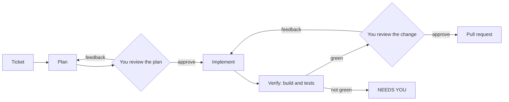
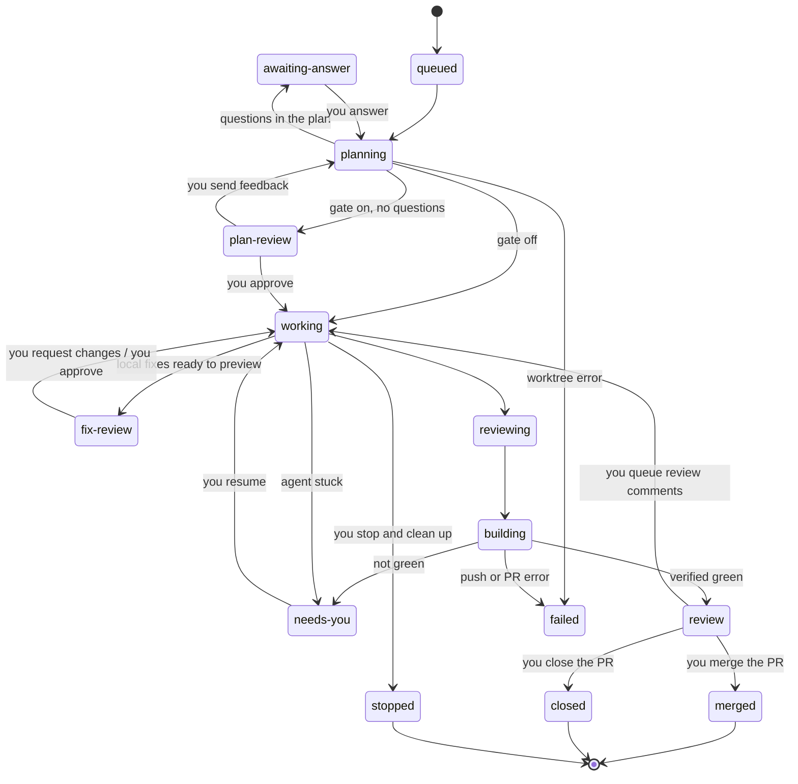

# Workflows in depth

This page walks through each workflow Apple Pie runs, every gate along the way, the lifecycle states, and how review comments are handled.

## The three workflows

### 1. Ticket to pull request

Start from a Jira key or a markdown file you write or paste.

1. **Plan.** The agent explores the codebase read-only and writes a plan. You read it, send feedback for a re-plan, or approve it. Blocking questions come to you before any code is written.
2. **Implement.** The agent makes the change in the ticket's worktree, then adversarially reviews its own diff and fixes what that turns up.
3. **Verify.** The agent runs your project's real build and tests — booting an emulator when the plan calls for instrumented tests — and certifies green only after seeing them pass. If it can't, the ticket goes to NEEDS YOU instead of becoming a PR.
4. **Review the change.** You see every changed file and its diff (workflow 3). Send feedback for another round, or approve and Apple Pie commits, pushes, and opens the pull request.

The plan review is opt-in per ticket (`--review-plan`, or `review_plans` in config); the change review is on by default.

### 2. Review comments

When reviewers comment on a PR, the row is flagged and Apple Pie fetches the threads from GitHub, bots included.

1. **Triage.** Each comment opens next to the diff hunk it's anchored to. Decide which ones the agent handles and which it skips, and add your own context to any of them. A comment that's a question, or needs no change, gets an answer drafted for the reviewer instead of a code change.
2. **Fix.** The agent fixes the comments you selected, locally only.
3. **Preview.** For every comment you see the diff of its fix and the reply that will be posted. Edit a reply, ask the agent to change a fix, or leave a thread out of this batch.
4. **Approve.** Apple Pie verifies the build, pushes to the same PR, posts the replies, and resolves the threads.

The full detail is in [When the reviewers come back](#when-the-reviewers-come-back).

### 3. Request changes

**Review and make changes** opens every change on the branch: the PR description, the changed files, and each file's diff. Talk it through with the agent in plan mode (it answers without touching code), or switch to auto mode and tell it what to change — mention files with `@`, or pick a line in the diff to point at it. The agent reworks the change and re-verifies, and the view comes back showing what moved since your feedback. When it looks right, create the pull request, or push to it if one is already open.

It works on any ticket and on any existing branch: **Checkout a branch** brings a branch into its own worktree, so you can review and rework code an agent didn't write.

## Staying in control

Apple Pie is built to hand tickets back rather than plough through them.

**The plan review gate.** Turn it on per ticket when queueing, with `--review-plan`, or as your default with `review_plans` in the config. The run pauses after planning; you read the plan in the TUI's full-screen viewer and either approve it or send feedback for a re-plan. Every plan is archived to `~/.pie/plans/<ticket>.md` regardless, so you can read it after the fact with **View Plan**.

**The review-before-PR gate (on by default).** After the agent's change builds and verifies, the ticket parks under NEEDS YOU as "review before PR" — nothing is committed, pushed, or opened as a PR yet. Enter opens the change screen with the chat box focused: the PR description and the changed files on the left, the focused file's diff on the right (↑ from the chat box moves into the list). → reads a file full screen, enter scrolls it, and enter on a line adds that `@file:line` to your message. Shift+tab switches the chat between **plan mode** — the agent answers your questions without changing code — and **auto mode**, where sending starts a rework: the agent changes the code, re-verifies, and the screen returns as the next round, showing what changed since your feedback. **Create pull request** re-verifies only if the change moved (your hand-edits in Android Studio count) and then ships. Turn the gate off with `review_before_pr = false`.

**NEEDS YOU.** An ambiguous ticket, a compile error the agent can't fix, or a verification that never went green all land here rather than being forced through. Answer in the TUI, resume the Claude session, or open the worktree in Android Studio and fix it by hand — then `--resume` to re-verify, or `--ship` to trust your fix and PR straight away.

**Verification is the default, `--ship` is your override.** A run never opens a PR on its own without a fresh, successful verification report. `--ship` exists for the case where *you* have fixed and checked the change by hand: it skips verification on your explicit say-so (from the CLI, or **Open a PR** in a stuck ticket's menu). An agent never takes that path on its own.

**It stops at `review`.** There is no auto-merge, no merge flag, and no code path anywhere in the project that merges a pull request.

**In-dashboard command approvals.** Agent Bash commands are gated by an allowlist, and your own Claude Code settings (including org-managed `ask`/`deny` rules) always apply on top. When a command needs a human — an `ask` rule fired, or the command isn't allowlisted — the agent pauses and the question comes to the dashboard: a `⏸` banner, the exact rule each *Allow & remember* option would write, and *Deny*; the agent continues in the same session the moment you answer. Commands your allowlist already covers are approved automatically, and everything you've remembered is reviewable, addable, and removable from **Edit config → Edit command allowlist** — arrows, Enter, and Esc, nothing else to learn. The full model — layers, rule syntax, denial diagnosis, the `⏸ approve:` log lines to look for — is in [permissions.md](permissions.md).

## Lifecycle states

These are the state names `pie status` and the dashboard print. Two rules worth knowing: blocking questions always win over the plan review gate — if the plan has questions you'll be asked them even with the gate off. And `merged` and `closed` aren't set by a run; the cleanup daemon writes them later when it sees what you did with the PR.

## When the reviewers come back

A PR at `review` isn't done — humans (and bots) leave comments on it. The dashboard polls your open PRs and shows a **`N comments`** badge on any ticket whose PR has unresolved review threads. Press <kbd>enter</kbd> on it to triage them.

**One list, one cursor, three keys.** Every open thread is a row: a checkbox, where it's anchored, what it says, and who said it. If the reviewer opened with a marker of their own — `nit:`, `blocking:` — it's lifted out of the prose and shown beside their name in the detail pane; nothing is inferred, because guessing severity from wording would misstate what a reviewer meant. <kbd>↑</kbd><kbd>↓</kbd> moves, <kbd>enter</kbd> acts on the row you're on, <kbd>esc</kbd> backs out one level. There are no letter shortcuts.

<kbd>enter</kbd> on a comment opens its menu: skip it (or fix it), write an instruction for the agent, or open the thread on GitHub. The first item is pre-selected and states the outcome, so skipping a comment is <kbd>enter</kbd> <kbd>enter</kbd>.

The first row is `all comments (8)` — the same box, no menu, and one press flips the lot. That plus the menu is the intended workflow: clear everything in one keystroke, then walk down and check the few you want. The last row is the run row, which spells out what it's about to do before you press it. Below the list, the detail pane shows the file and line, the diff hunk, the comment in full, and **your instruction** — guidance the agent reads before fixing that one comment ("use the existing retry helper"). It is not a reply to the reviewer, which is why it isn't called a note. Rows carrying one show `✎`.

**Nothing is hidden.** Every comment is listed, bots included — CodeRabbit, Copilot and Sonar just get their names tinted. A filter that hides them by default hides their blocking findings and CVE reports too, which is exactly the kind of comment you can't afford to answer a PR without reading. Fetching is automatic (on entry, then every two minutes); the header says `synced 2m ago`, or `sync failed — retrying`.

Run the batch and Apple Pie re-enters the ticket's existing worktree and applies exactly the comments you selected — **locally, and then it stops**. Nothing is committed, pushed, or posted yet. The ticket parks at `fixes ready` and the screen becomes a preview: per comment, the actual worktree diff the fix produced and the reply the agent drafted for the reviewer (or its reason for declining). From there:

- **Edit the reply** — rewrite the draft inline; it posts exactly as you typed it, nothing more.
- **Request changes** — tell the agent what's wrong ("use the existing retry helper instead"); it revises the local fixes in the same session and the preview refreshes. Loop as many times as you like — feedback rounds are fast because verification waits until the end.
- **Exclude from this ship** — leave a thread open for a later pass; Apple Pie will not mark it addressed, reply to it, or resolve it. If its local code also needs undoing, request changes and tell the agent to revert that part of the batch.
- **Approve** — the run bar says what it's about to do: verify the build, commit, push to the same branch (the open PR updates in place), post each reply, and mark the threads resolved. Only then does anything leave your machine. The reply and resolve write-backs stay switchable (`review_reply`, `review_resolve`) — on some teams, resolving a thread is the reviewer's call.

The preview is durable — it lives in the worktree and the state database, so you can close the TUI, sleep on it, and approve tomorrow. And a skipped or half-fixed batch isn't a dead end: threads you didn't include keep their badge, and a reviewer replying to any thread reopens it on the next poll.
